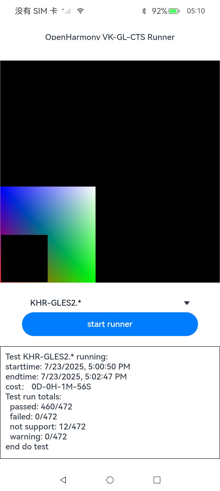

VK-GL-CTS for OpenHarmony Instructions
=================

This document describes how to build, port, and run the VK-GL-CTS conformance tests.

Preparation
------------------------

There are two ways for Build source with OpenHarmony:
1. Download the OpenHarmony Public SDK or HarmonyOS Command Line Tools, For example: 
* OpenHarmony Public SDK download url:
    > https://repo.huaweicloud.com/openharmony/os/5.1.0-Release/ohos-sdk-windows_linux-public.tar.gz

* HarmonyOS Command Line Tools download url:
    > https://developer.huawei.com/consumer/cn/download/command-line-tools-for-hmos


2. Extract the sdk and set the environment, For example:
* set node path:
    ```
    export PATH=${SDK_PATH}/tool/node/bin:$PATH
    node -v
    v18.20.1
    ```
    
* set hvigor path:
    ```
    export PATH=${SDK_PATH}/bin:$PATH 
    hvigorw -v
    5.18.4
    ```


Build
------------------------
Run the script of build files in scripts folder:

>  python scripts/ohos/build_hap.py --build-root=./ohosbuild --target=deqp --clt ~/workspace/tools/command-line-tools --sdk ~/workspace/tools/ohos-sdk-5.0.1-release
* --build-roots: build root dirname (default: ohosbuild)
* --target: deqp (default: deqp)
* --clt: Command-Line-Tools
* --sdk: OpenHarmony Public SDK

After complete the build, the "app1-signed".hap will be find in "ohosbuild\happroject\autosign\app1-signed.hap"


Test
---------------------
1. Install the hap
```
hdc install app1-signed.hap
```

2. Run the case



